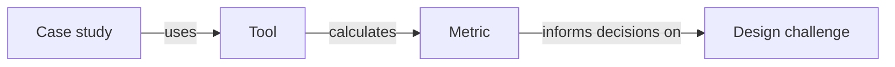

**How do designers decide with evidence?** This knowledge base maps the design challenges of logistics architecture to the **metrics** that inform decisions, the **tools** that calculate them, and the **case studies** — student projects from the *Rethinking.Logistics* studio at ARCHIP Prague (2026) — that show it in practice.

## Start here

| I want to… | Go to |
| --- | --- |
| …find what to measure for my design challenge | **[[Challenge map]]** |
| …know how a metric is calculated, and with which tool | **[[Metric catalogue]]** |
| …see what a tool (Ladybug, One Click LCA, Karamba3D …) can calculate | **[[Tool directory]]** |
| …browse the student projects | **[[Case studies overview]]** |
| …see which metrics pull against each other | [[Trade-offs]] |
| …see where evidence is missing | [[Evidence gaps]] |

Use the **search** (top left): it ignores accents, finds parts of words and tolerates small typos.

## The four building blocks

- **Challenges** — problems tackled with evidence-based design, e.g. [[Stormwater and sealed surfaces on logistics sites]] or [[Waste heat and cooling of data centres]].
- **Metrics** — measurable indicators (students often call them KPIs), each with a unit and a **calculation method**, e.g. [[Biotope area factor]] or [[Embodied carbon intensity]].
- **Tools** — mainly the Rhino/Grasshopper ecosystem ([[Ladybug]], [[Honeybee]], [[Karamba3D]], [[Rhino.Ecologic]] …) but also web tools like [[One Click LCA]], [[nPro]] or [[CO2mpare]].
- **Case studies** — 23 student projects with their metrics, values, tools, trade-offs and decisions, each linked to the full portfolio.

> [!note] Draft
> All entries are drafts compiled from the student portfolios and studio questionnaires and are being reviewed by the studio tutors. See [[How to contribute]] to suggest a correction.
